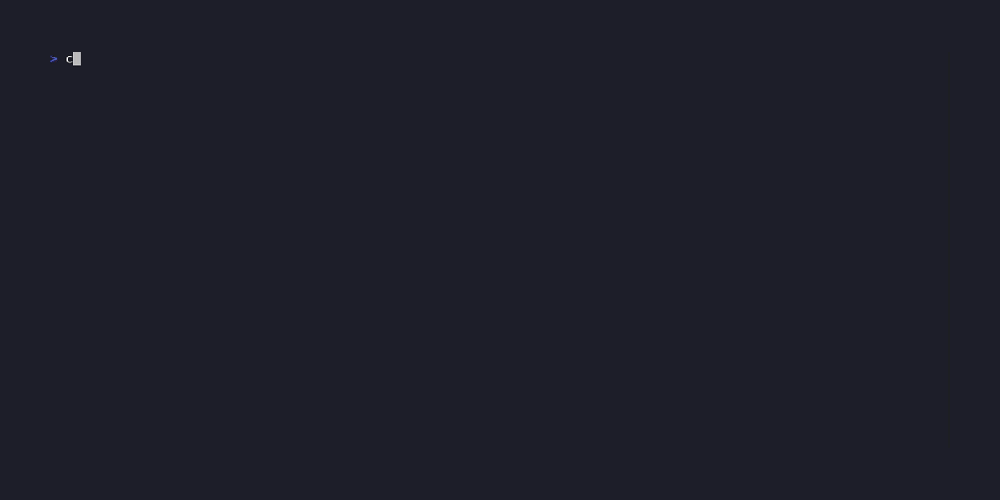

# mtop

A demonstration tool showcasing [llm-d](https://llm-d.ai)'s enterprise-ready LLM deployment and management capabilities.


**See llm-d in action: GPU-aware scheduling, SLO-driven autoscaling, and cost optimization for LLM workloads.**

## What is llm-d?

[llm-d](https://llm-d.ai) is Red Hat's open source platform for deploying and managing Large Language Models at scale. It provides:

- **GPU-Aware Orchestration**: Intelligent scheduling across heterogeneous GPU clusters (H100, A100, DRA)
- **SLO-Driven Operations**: Automatic scaling based on Time-to-First-Token (TTFT) and latency targets
- **Cost Intelligence**: 40% reduction in GPU costs through dynamic right-sizing and bin-packing
- **Enterprise Integration**: Native OpenShift/Kubernetes integration with RBAC and multi-tenancy

## About This Demo

mtop simulates a production llm-d environment without requiring a live cluster, allowing you to:

- Demonstrate llm-d's real-time monitoring capabilities
- Showcase SLO convergence and autoscaling behavior
- Illustrate GPU utilization optimization
- Present cost savings through intelligent scheduling

## Quick Demo

```bash
# Show llm-d's real-time monitoring
./mtop-main

# Demonstrate SLO-driven autoscaling
./mtop-main slo-dashboard

# Showcase deployment strategies
./mtop-main simulate canary
```

## Key llm-d Capabilities Demonstrated

### 🎯 SLO-Driven Autoscaling


llm-d automatically scales deployments to meet TTFT and latency targets while minimizing cost.

### 💰 Intelligent Cost Optimization


GPU-aware bin-packing and right-sizing reduces infrastructure costs by up to 40%.

### 🔥 Heterogeneous GPU Management


Seamlessly manage H100, A100, and DRA clusters with unified scheduling and monitoring.

### 📊 Enterprise-Ready Operations


Production-grade monitoring, RBAC, and multi-tenant isolation for enterprise deployments.

## Demo Scenarios

Pre-configured scenarios showcasing llm-d capabilities:

```bash
./scripts/demo.py startup           # Small team adopting llm-d
./scripts/demo.py enterprise        # Large-scale llm-d deployment
./scripts/demo.py cost-optimization # Cost reduction showcase
```

## Installation

```bash
# Requirements: Python 3.12+
pip install -r requirements.txt
chmod +x mtop-main

# Run the demo
./mtop-main
```

## Learn More About llm-d

- 🌐 **Website**: [llm-d.ai](https://llm-d.ai)
- 📚 **Documentation**: [docs.llm-d.ai](https://docs.llm-d.ai)
- 🐙 **GitHub**: [github.com/redhat-et/llm-d](https://github.com/redhat-et/llm-d)
- 💼 **Enterprise**: Contact Red Hat for OpenShift AI integration

## Demo Documentation

- [Demo Guide](DEMO-GUIDE.md) - Step-by-step demonstration instructions
- [Sales Demo Guide](SALES-DEMO-GUIDE.md) - Customer-facing demo playbook
- [Architecture](ARCHITECTURE.md) - Technical deep dive

## Contributing

This demo tool is part of the llm-d project. For contributions:
- llm-d project: [github.com/redhat-et/llm-d](https://github.com/redhat-et/llm-d)
- Demo improvements: See [COLLABORATION.md](COLLABORATION.md)

---

Part of the [llm-d](https://llm-d.ai) project by Red Hat AI Engineering.